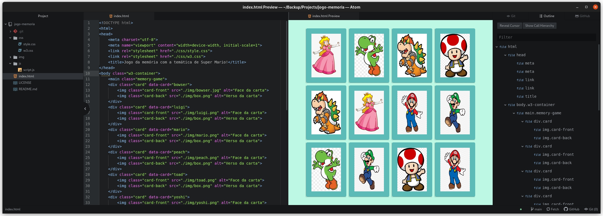

# Jogo Memoria
Jogo da memória com a temática de Super Mario!

Projeto, **jogo da memória** utilizando apenas HTML, CSS e Javascript.
Este projeto tem como base

## Tecnologias usadas
- CSS
- HTML
- JavaScript
- W3.CSS

Neste projeto foi adicionado o framework W3.css com o objetivo de melhorar a
responsividade em dispositivos móveis.

Com poucas
linhas de código, aprenderemos juntos a trabalhar com efeitos 3D no CSS e lógica de programação utilizando condicionais, Immediately Invoked Function Expression e manipulação de Array em um projeto super divertido.Nesse projeto, o desafio será criar um jogo da memória utilizando apenas HTML, CSS e Javascript. Com poucas linhas de código, aprenderemos juntos a

Este projeto faz parte do Bootcamp **JavaScript Game Developer** da Dio, sob
supervisão da Gabriela Pinheiro.
